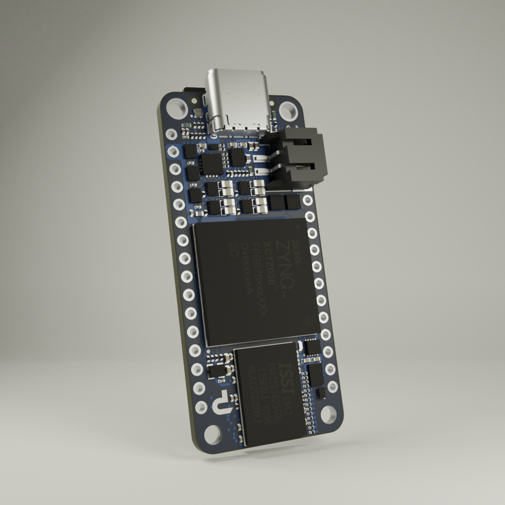
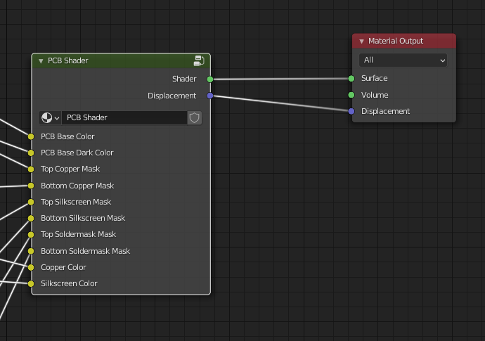
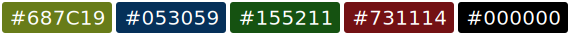

# stylized-blender-setup

This repository provides a comprehensive shader setup that you can use to turn exported PCB models into photorealisitc rendered images in Blender. As an example the Blender file includes this scene:

If you just want to download the Blender project, we recommend you to **not clone this repo since it's very large in file size**. Instead you can download the `.blend` file and all necessary textures from the [Releases page](https://github.com/PCB-Arts/stylized-blender-setup/releases) as a compressed ZIP folder.

## Shader Configuration

**Inputs:**

| Name | Type | Description |
| ---- | ---- | ----------- |
| PCB Base | `Color` | Color of the PCB's surface with soldermask and copper underneath.   Recommendations:   |
| PCB Base Dark | `Color` | Color of the PCB's surface with soldermask and no copper underneath (this is usually darker than the color of PCB Base).   Recommendations:    |
| Top / Bottom Copper Mask | `Image` | B/W Texture of the Copper Layer. Expects black areas to indicates **Copper** and white areas to indicate **no Copper**. |
| Top / Bottom Silkscreen Mask | `Image` | B/W Texture of the Silkscreen Layer. Expects black areas to indicate **Silkscreen** and white areas to indicate **no Silkscreen**. |
| Top / Bottom Soldermask Mask | `Image` | B/W Texture of Soldermask Layer. Expects black areas to indicate **no Soldermask** and white areas to indicate **Soldermask**. |
| Copper Color | `Color` | Color of the exposed copper. Usually silver-ish or gold-ish.   Recommendations:   |
| Silkscreen Color | `Color` | Color of the silkscreen. Usually just white. |

**Outputs:**

| Name | Type | Description |
| ---- | ---- | ----------- |
| Shader | `Shader` | A combination of silkscreen, soldermask and copper materials according to the layer masks. There is also a material between the top and bottom which is visible on the sides of the PCB. |
| Displacement | `Displacement Map` | Contains bumps on the surface caused by different layers. |

Eventhough the shader configuration is quite complex, we encourage you to look into it and play around with the materials and parameters. We tried our best to configure the materials as realistic as possible, but don't hesitate to change them for your needs as you may find even more realistic parameters.

